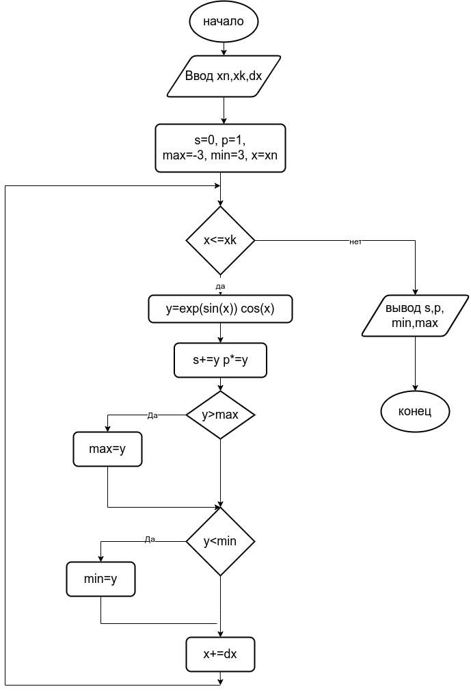
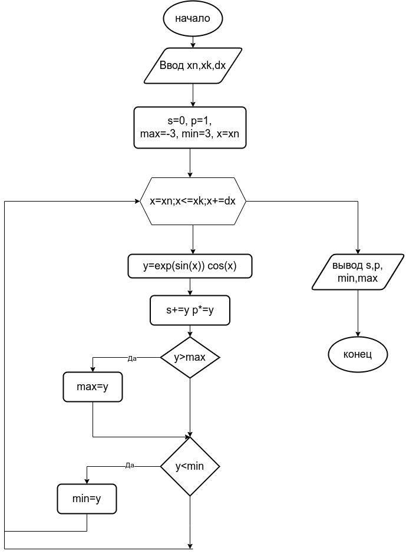
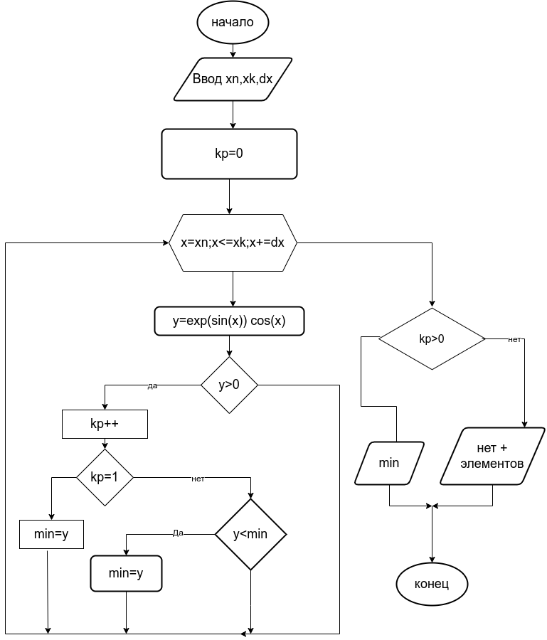

# Базовые циклические алгоритмы

**Задача 1.** Переменная x меняется от xn до xk с шагом dx. Значение y вычисляется по формуле 

$$
 y=e^{sin x} cosx 
$$


Найти сумму и произведение значений y, минимальное и максимальное значение y.

 Блок-схема алгоритма приведена ниже.




Напишем код программы на С.

``` C
#include <stdio.h>
#include <math.h>
int main()
{
float x,xn,xk,dx,y,min,max,s, p;
printf("Введите xn, xk,dx");
scanf("%f%f%f",&xn,&xk,&dx);
s=0;p=1;min=3;max=-3;x=xn;
while (x<=xk) 
{
y=exp(sin(x))*cos(x);
printf("x=%1.3f\ty=%1.3f\n",x,y);
s+=y;p*=y;
if (y<min) min=y;
if (y>max) max=y;
x+=dx;
}
printf("сумма=%1.3f\tпроизведение=%1.3f\tминимум=%1.3f\tмаксимум=%1.3f\n", s,p,min,max);
return 0;
}
```
Перепишем код с использованием оператора for. Блок-схему в этом случае можно представить так.


Модифицируем код программы.

``` C
#include <stdio.h>
#include <math.h>
int main()
{
float x,xn,xk,dx,y,min,max,s, p;
printf("Введите xn, xk,dx");
scanf("%f%f%f",&xn,&xk,&dx);
s=0;p=1;min=3;max=3;
for(x=xn;x<=xk;x+=dx) 
{
y=exp(sin(x))*cos(x);
printf("x=%1.3f\ty=%1.3f\n",x,y);
s+=y;p*=y;
if (y<min) min=y;
if (y>max) max=y;
}
printf("сумма=%1.3f\tпроизведение=%1.3f\tминимум=%1.3f\tмаксимум=%1.3f\n", s,p,min,max);
return 0;
}
```

Значительно более интересной задачей для понимания базовых алгоритмов является следующая.

**Задача 2.** Переменная x меняется от xn до xk с шагом dx. Значение y вычисляется по формуле 
$$
 y=e^{sin x} cosx 
$$

Найти минимальное значение среди положительных значений y.

Блок-схема алгоритма может быть представлена так.



Рассмотрим код программы

``` c
#include <stdio.h>
#include <math.h>
int main()
{
float x,xn,xk,dx,y,min;
int kp;
printf("Введите xn, xk,dx");
scanf("%f%f%f",&xn,&xk,&dx);
kp=0;
for(x=xn;x<=xk;x+=dx) 
{
y=exp(sin(x))*cos(x);
printf("x=%1.3f\ty=%1.3f\n",x,y);
if (y>0)
	{
		kp++;
		if (kp==1) min=y;
		else if (y<min) min=y;
	}
}
 if (kp>0) printf("минимум=%1.3f\n", min);
 else printf("Нет положительных чисел\n");
return 0;
}

```


